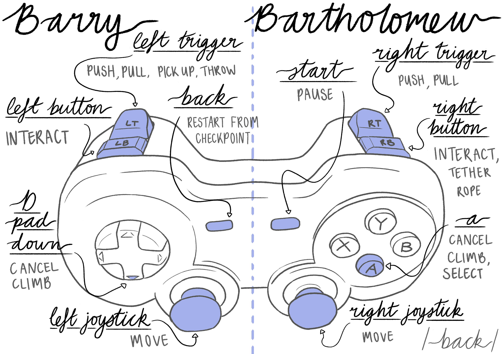

# PuzzleBois

Link to the github
https://github.com/MVeng/PuzzleBois

Most of content is contained in https://github.com/MVeng/PuzzleBois/tree/master/Content/SideScrollerBP 

 

Installation and setup instructions 

Install and run PuzzleBois.exe from the github release

Controller is the best way to play and tutorials are based on controller gameplay. There is however key mapping 
for keyboard if a controller is not available.  

Once launched, navigate the menu to the controls or tutorial. Once completed, there is a list of levels in the ‘level select’ 
which contains levels of ascending difficulty. The harder levels display most of the functionality, including power ups but are more complicated, 
and obviously less straight forward. 

Gameplay video
https://drive.google.com/file/d/1gLJ7UgX_MyvhM8uqfJngdfQPCEL07LW9/view

Code explantion/overview
https://drive.google.com/file/d/1I4sLQac5Ulmq4NHJr6slj1hOqenmj6Gy/view

Developed with Unreal Engine 4